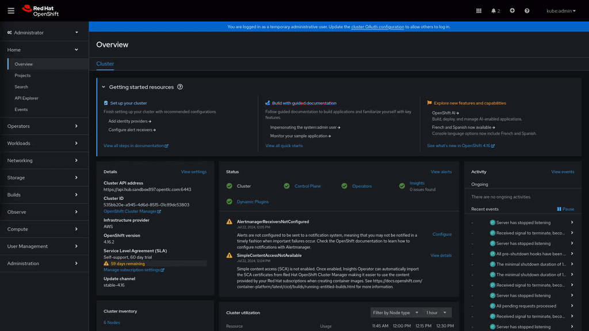

 
# Workload placement accross multiple OpenShift clusters

## Background

### The challenge

### The solution

### The value

## Concepts reviewed during the demo

* OpenShift GitOps
* Advanced Cluster Management Placement API

## Demo pre-requirements

### Duration
Less than 30 min

### Environment & Hardware 

* **OpenShift "Hub" Cluster**: Typically configured with 3 worker nodes, each possessing 8 cores and 16GB of memory.
* **OpenShift "Near-Edge" Clusters**: At least one additional OpenShift cluster (Minimum resources is ok). 

## Environment Setup

All demo deployments comprehends four simple steps:

1. **Prepare your OpenShift Clusters**: Ensure you have freshly installed the required OpenShift clusters.

2. **Apply the Base Configuration in the Hub Cluster**:
   - Access your OpenShift console in the Hub cluster.
   - Click the `+` button to add resources.
   - Paste the content from the [bootstrap-environment.yaml](../../bootstrap-environment/bootstrap-environment.yaml) file.

3. Wait until you can open the Advanced Cluster Manager console.

4. **Apply the demo specific setup**
   - Access your OpenShift console in the Hub cluster.
   - Click the `+` button to add resources.
   - Paste the content from the [bootstrap-demo.yaml](bootstrap-demo/bootstrap-demo.yaml) file.

After applying the configuration, sit back and relax while the environment is set up automatically. You can open the Argocd console and with for all applicantions to be in "Sync" status.

Once the setup is complete, you can proceed with the demo steps.

  > **NOTE**
  >
  > *If you don't know what I mean with the `+` button in OpenShift, take a look at the following example:*
  >
  

## Demo Steps

## Going beyond