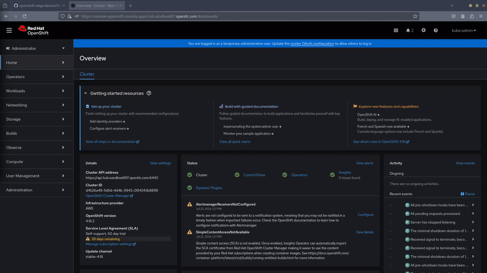
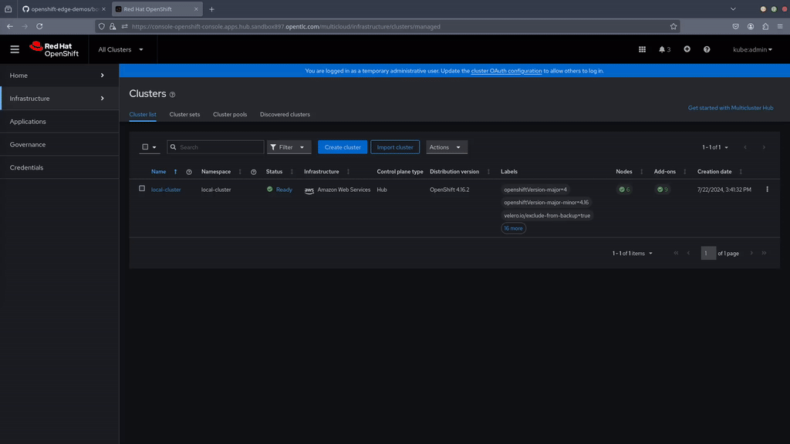
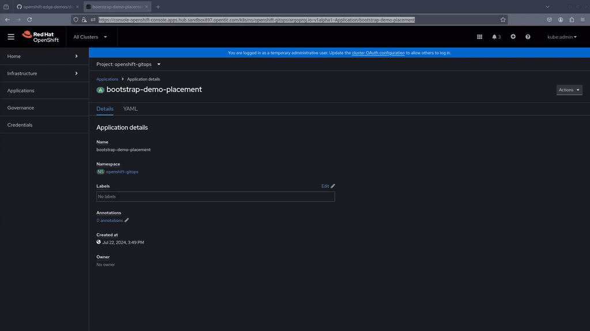

# Workload Placement - Demo Preparation

## Environment & Hardware requirements 

* **OpenShift "Hub" Cluster**: Typically configured with 3 worker nodes, each possessing 8 cores and 16GB of memory.
* **OpenShift "Edge" Clusters**: At least one additional OpenShift cluster (Minimum resources is ok). 

  > **NOTE**
  >
  > The "Hub" Cluster is the OpenShift Cluster where ACM is deployed. In this case this will be our "Cloud" cluster.


## Environment Setup

All demo deployments comprehends three main groups of steps:

0. **Clone this repository and ajust values**

1. **OpenShift "Hub" Cluster base configuration**

2. **Demo specific setup**


### 0. Fork this repository and adjust values
You will need to change values in GitHub during the demo, so you will need to fork it.

1. Fork `https://github.com/luisarizmendi/openshift-edge-demos` into your GitHub account
2. Clone it locally in your desktop
3. Run the `change_repo_url.sh` that will change all references in the repo to use your fork

   ```bash
   cd scripts
   ./change_repo_url.sh https://github.com/<your github user>/<fork name>
   ```
  > **NOTE**
  >
  > Do not include the tailing `.git` or any slash at the end.

3. Push changes to your fork repo

   ```bash
   cd ..
   git add .
   git commit -m "Change repo references"
   git push
   ```

### 1. OpenShift "Hub" Cluster base configuration

You need to complete these steps before deploying your demo:

1. **Prepare your OpenShift Clusters**: Ensure you have freshly installed the required OpenShift clusters. The demo has been tested with OpenShift 4.16.

2. **Apply the Base Configuration in the Hub Cluster**:
   - Access your OpenShift console in the Hub cluster.
   - Click the `+` button to add resources.
   - Paste the content from the [bootstrap-environment.yaml](../../../bootstrap-environment/bootstrap-environment.yaml) file.



  > **NOTE**
  >
  > It's possible that if you try to access ACM as soon as the web plugin update message appears, you will get another warning message that says "Red Hat Advanced MAangement for Kubernetes is not ready".Just wait a little bit more time so the ACM is completely up.

3. **Wait until you can open the Advanced Cluster Manager console**


### 2. Demo specific setup

Now you can deploy the components needed by your demo and apply the required configuration.

4. **Apply the demo specific setup**
   - Access your OpenShift console in the Hub cluster.
   - Click the `+` button to add resources.
   - Paste the content from the [bootstrap-demo.yaml](../bootstrap-demo/bootstrap-demo.yaml) file.



5. **Wait until you can see all applications in "Sync"status in the Argocd console** 




## Post-deployment Walkthrough

After the environment and demo bootstrap you will have:

* The Advanced Cluster Management and the Arco CD Controller ready in your OpenShift Hub Cluster. 
* A couple of `ClusterSets` have been pre-defined in ACM, "cloud" and "edge". Those will be used during the Placement API demo section.


If you open the ACM console ("All-Cluster" in the dropdown menu of the top left corner in the OpenShift console) and go to "Infrsatructure", you can see how you have the default `local-cluster` but checking the "ClusterSets" tab you will see that, for this demo, a couple of `ClusterSets` have been pre-defined in ACM, "cloud" and "edge". Those will be used during the Placement API demo section.

In the Argo CD UI (you can open it by clicking on the squares on the top right on the OpenShift Console), you can check that you have two Argo CD applications already created. The `advanced-cluster-management` application deployed ACM in your Hub Cluster, and the `bootstrap-demo-placement` prepared the environment for the demo (ie. creating the already mentioned `ClusterSets` and more).


default clusterset para argo


In addition, now you should have one or more additional OpenShift clusters ready to be used during the demo steps.


## Importing additional OpenShift Clusters

During the demo we will be scheduling applications across multiple OpenShift clusters, so you will need to have more than a single OpenShift managed by ACM and Argo CD.

In this demo example we will be using one "Cloud" cluster (the "Hub") and one additional Edge cluster. The Hub cluster must be already imported in ACM (`local-cluster`) so we just need to add the additional Edge cluster.

There are three ways of importing a cluster:
* Run the import commands manually
* Enter Server URL and API token
* Using the `kubeconfig`

Personally I find the server URL and API token the most straighforward since you can obtain them easily:

1. Open the OpenShift cluster console in the cluster that you want to import
2. Click on the top right corner where you see your user (`kube:admin` if using "kubeadmin" user)
3. Click on "Copy login command" and then "Display token"
4. Copy the `token` and `server` parameters


With that info you can proceed to import the cluster. Be sure that you select the "edge" `ClusterSet` and **you name it as "edge-1"**, since the APP environment variables are prepared for that cluster name, otherwhise you will need to modify the Helm variables during the demo steps.


