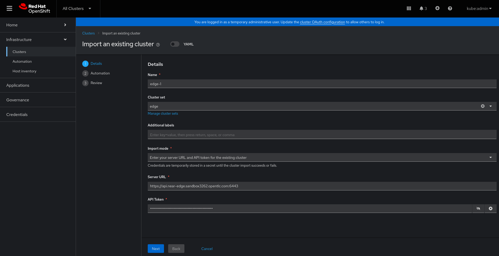
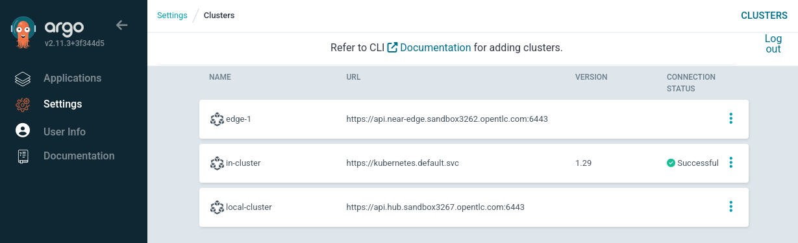

# Workload Placement - Demo Preparation

## Environment & Hardware Requirements

* **OpenShift "Hub" Cluster**: Typically configured with 3 worker nodes, each having 8 cores and 16GB of memory.
* **OpenShift "Edge" Clusters**: At least one additional OpenShift cluster (minimal resources are acceptable).

  > **Note**
  >
  > The "Hub" Cluster is where ACM is deployed. For this demo, it will serve as the "Cloud" cluster.

## Environment Setup

The demo deployment involves three main steps:

1. **Clone this repository and adjust values**
2. **OpenShift "Hub" Cluster base configuration**
3. **Import the OpenShift clusters into ACM**
4. **Demo-specific setup**

### 1. Fork this Repository and Adjust Values

To change values during the demo, fork this repository.

1. Fork `https://github.com/luisarizmendi/openshift-edge-demos` into your GitHub account.
2. Clone it locally on your desktop.
3. Run the `change_repo_url.sh` script to update all repository references to your fork:

   ```bash
   cd tools
   ./change_repo_url.sh https://github.com/<your-github-username>/<fork-name>
   ```
  > **NOTE**
  >
  > Do not include the tailing `.git` or any slash at the end.

3. Push changes to your fork repo

   ```bash
   cd ..
   git add .
   git commit -m "Change repo references"
   git push
   ```

### 1. OpenShift "Hub" Cluster Base Configuration

Complete the following steps before deploying your demo:

1. **Prepare Your OpenShift Clusters**: Ensure that the required OpenShift clusters are freshly installed. This demo has been tested with OpenShift 4.16.

2. **Apply the Base Configuration to the Hub Cluster**:
   - Access your OpenShift console in the Hub cluster.
   - Click the `+` button to add resources.
   - Paste the content from the [bootstrap-environment.yaml](../../../bootstrap-environment/bootstrap-environment.yaml) file.

   

   > **Note**
   >
   > If you try to access ACM immediately after seeing the web plugin update message, you might encounter a warning stating "Red Hat Advanced Management for Kubernetes is not ready." Please wait a bit longer for ACM to fully initialize.

3. **Wait Until the Advanced Cluster Manager Console is Accessible**

   

### 2. Import the OpenShift Clusters into ACM

For this demo, you will be scheduling applications across multiple OpenShift clusters. Thus, you need more than one OpenShift cluster managed by ACM and Argo CD. We will use one "Cloud" cluster (the "Hub") and one additional Edge cluster. The Hub cluster is already imported into ACM (`local-cluster`), so you only need to add the additional Edge cluster.

There are three ways to import a cluster:
* Run the import commands manually
* Enter Server URL and API token
* Use the `kubeconfig`

The Server URL and API token method is straightforward:

1. Open the OpenShift cluster console of the cluster you want to import.
2. Click on the top right corner where your user is displayed (`kube:admin` if using the "kubeadmin" user).
3. Click "Copy login command" and then "Display token".
4. Copy the `token` and `server` parameters.

To import the cluster:

1. Open the ACM UI by selecting "All Clusters" from the dropdown menu on the top left corner of the OpenShift Hub cluster.
2. Navigate to Infrastructure > Clusters and click on the "Import Cluster" button.
3. Fill in the form. Ensure you **name the new cluster "edge-1"**, as the APP environment variables are set up for this cluster name. Otherwise, you will need to modify the Helm variables during the demo.

   

4. Click "Next" a few times and wait for the cluster to reach the Ready state.

As mentioned earlier, a `GitOpsCluster` object was created during the bootstrap to integrate any cluster imported into the "global" `ClusterSet` into Argo CD. You can verify this integration:

1. Open Argo CD by clicking the squares icon in the top right corner of the OpenShift Hub cluster console.
2. Click "Settings" on the left menu, then "Clusters".

   

### 3. Demo-Specific Setup

Now you can deploy the components required for your demo and apply the necessary configurations.

1. **Apply the Demo-Specific Setup**:
   - Access your OpenShift console in the Hub cluster.
   - Click the `+` button to add resources.
   - Paste the content from the [bootstrap-demo.yaml](../bootstrap-demo/bootstrap-demo.yaml) file.

   

2. **Wait Until All Applications Are in "Sync" Status in the Argo CD Console**:

   

## Post-Deployment Walkthrough

After completing the environment and demo bootstrap, the Advanced Cluster Management and the Argo CD Controller will be ready in your OpenShift Hub Cluster.

In the ACM console ("All Clusters" dropdown menu at the top left corner in the OpenShift console), navigate to "Infrastructure > Clusters" to see your clusters. Under the "ClusterSets" tab, you'll notice that a couple of `ClusterSets` have been predefined: "cloud" and "edge." These will be used during the Placement API demo.

In the Argo CD UI (accessible via the squares icon in the top right of the OpenShift console), you can see two Argo CD applications already created: `advanced-cluster-management` (deploying ACM in your Hub Cluster) and `bootstrap-demo-placement` (preparing the demo environment, including creating the `ClusterSets` and more).

To explore the objects generated during the demo bootstrap, open the `bootstrap-demo-placement` application in the Argo CD UI. Here, you can find other useful objects, such as the `GitOpsCluster` manifest, which automatically creates the clusters in Argo CD when imported into ACM, allowing you to skip this step during the demo.

## Next

[Start the Demo](../README.md#demo)
