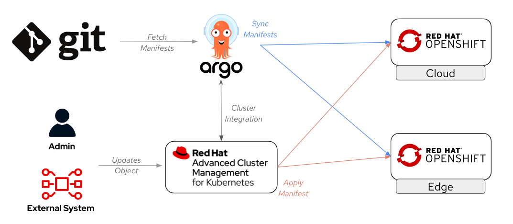

# Placement with Argo CD ApplicationSet Generators

When using `ApplicationSet` manifests with [Argo CD](https://argo-cd.readthedocs.io/en/stable/), you can use templates to create different `ApplicationSets` based on parameters generated by the ["Generator" section](https://argo-cd.readthedocs.io/en/stable/operator-manual/applicationset/Generators/). This can be useful for customizing the destination cluster and associated variables of the deployed application from a single `ApplicationSet` object.

There are multiple different Generators, but for convenience and simplicity, in this demo we are going to use:

* Creating an `Application` object per cluster configured in a static list in the `ApplicationSet`.
* In each of those clusters, creating an `Application` object per application located in a specific directory in a Git repository.

For the first point, we will be using the [Git generator](https://argo-cd.readthedocs.io/en/stable/operator-manual/applicationset/Generators-Git/), and for the second one, the [List generator](https://argo-cd.readthedocs.io/en/stable/operator-manual/applicationset/Generators-List/).

> **NOTE**
>
> You can also use other generators to achieve the same outcome, but these were selected for convenience and ease of use in this demo.

Since we are using multiple generators in the same `ApplicationSet` manifest, we must also use another type of "Generator," the [Matrix generator](https://argo-cd.readthedocs.io/en/stable/operator-manual/applicationset/Generators-Matrix/), to make them work together.

Below is a diagram illustrating the explained process:


```
                                                                  --> Child Application (Cluster 1 - dir 1)
                                                                 /
                                             --> (Git generator) -->  Child Application (Cluster 2 - dir 2)
                                           /                     \
                                          |                       --> Child Application (Cluster 1 - dir N)
                                          | 
                                          | 
                                          |                      --> Child Application (Cluster 1 - dir 1)
                                          |                     /                             
Parent ApplicationSet ---(List generator) ----> (Git generator) -->  Child Application (Cluster 2 - dir 2)
                                          |                     \
                                          |                      --> Child Application (Cluster 3 - dir N)
                                          | 
                                          |                         
                                          |                       --> Child Application (Cluster 1 - dir 1)
                                           \                     /
                                             --> (Git generator) -->  Child Application (Cluster 2 - dir 2)
                                                                 \
                                                                  --> Child Application (Cluster 1 - dir N)
```


Thanks to the "Matrix Generator" and templating, we can create all the different `Application` objects from a single manifest instead of having to create an `Application` object per cluster and per app, which simplifies management.

When we need to include a change using this approach (ie. remove the APP from the Cloud clusters and deploy it in the Edge Clusters), what it's needed is to change the already created `ApplicationSet`, so the new `Application` objects are generated. In this demo we are doing it manually directly on the OpenShift clusters, but this could also be done using ACM as a central point:




## Deploy on Cloud

To deploy the child applications, create the parent `ApplicationSet` object with the Generators:

1. Access your OpenShift console in the Hub cluster.
2. Click the `+` button to add resources.
3. Paste the following content, changing the `repoURL` to point to your own repo:

    ```yaml
    apiVersion: argoproj.io/v1alpha1
    kind: ApplicationSet
    metadata:
      labels:
        app.kubernetes.io/managed-by: demo-placement-global
      name: demo-placement-global
      namespace: openshift-gitops
    spec:
      generators:
        - matrix:
            generators:
              - git:
                  directories:
                    - path: apps/welcome/*
                  repoURL: 'https://github.com/luisarizmendi/openshift-edge-demos.git'
                  revision: main
              - list:
                  elements:
                  - cluster: local-cluster
                    url: https://kubernetes.default.svc
      goTemplate: true
      goTemplateOptions:
        - missingkey=error
      template:
        metadata:
          labels:
            app.kubernetes.io/managed-by: demo-placement-global
          name: '{{.path.basename}}-{{.cluster}}'
        spec:
          destination:
            namespace: '{{.path.basename}}'
            server: '{{.url}}'
          project: demo-placement
          source:
            helm:
              valueFiles:
                - values.yaml
                - environment/values-{{.cluster}}.yaml
            path: '{{.path.path}}'
            repoURL: 'https://github.com/luisarizmendi/openshift-edge-demos.git'
            targetRevision: main
          syncPolicy:
            automated:
              prune: true
              selfHeal: true
    ```

In this parent `ApplicationSet` object, you can see both the "Git Generator" and the "List Generator." The "List Generator" includes information about the target clusters where the apps will be deployed, while the "Git Generator" points to the directory located in the Git repository where the different manifests of each app (separated into dedicated subdirectories) reside.

After creating the object you will see how the "hello" APP has been deployed on the `local-cluster` OpenShift cluster (`hello-local-cluster` Application in Argo CD UI):


You can also open the `Application` object to obtain the URL for your APP. Open the "hello-world" route and see in the "Live Manifest" the generated "host" route for your APP, it will be something like `hello-world-hello.apps.<cluster name>.<domain>`. 

IF you open the APP, you will see how it has been deployed with some specific "values" for that cluster, including the cluster name and zone ("Cloud" in this case).

## Deploy on Edge

Now we are going to switch the app from the Cloud to the Edge clusters. To do that, follow these steps:

1. Access your OpenShift console in the Hub cluster.
2. Edit the `demo-placement-global` object. You can find it by going to the `local-cluster` console, clicking on "Home > API Explorer" and looking for `ApplicationSet` `argoproj.io/v1alpha1` instances.
3. Open the YAML and modify the "List generator" with the information of the Edge clusters (you can check the cluster name and URL in Argo CD under Settings > Clusters). You should have something like:

    ```yaml
    ...
    ...
    generators:
        - matrix:
            generators:
              - git:
                  directories:
                    - path: apps/welcome/*
                  repoURL: 'https://github.com/luisarizmendi/openshift-edge-demos.git'
                  revision: main
              - list:
                  elements:
                    - cluster: edge-1
                      url: https://api.near-edge.sandbox3262.opentlc.com:6443
    goTemplate: true
    goTemplateOptions:
        - missingkey=error
    template:
    ...
    ...
    ```

As soon as you make the change, the "hello" APP will be deleted from the `local-cluster` and created in the `edge-1`. You will see something like the screenshoot shown below while transitioning from one cluster to the other, before the `edge-1` becomes synced:


After some seconds, you will see how the "hello" app deployed (Green status) in the `edge-1` cluster, and if you open the `Application` object, look for the APP URL and open the APP, you will see how the APP values addapted to this new clusters, giving different information than when it was deployed on the Cloud.

## Clean-Up

Once you have finished moving the app around your clusters, you can delete the `Application` and `ApplicationSet` objects:

1. Access your OpenShift console in the Hub cluster.
2. Click the `+` button to add resources.
3. Paste the following content:

    ```yaml
    apiVersion: batch/v1
    kind: Job
    metadata:
      generateName: cleanup-demo-placement-global-
      namespace: openshift-gitops
    spec:
      template:
        spec:
          serviceAccountName: openshift-gitops-argocd-application-controller
          containers:
            - name: delete-apps
              image: openshift/origin-cli:latest
              command: ["oc"]
              args: ["delete", "applications", "-n", "openshift-gitops", "-l", "app.kubernetes.io/managed-by=demo-placement-global"]
            - name: delete-appsets
              image: openshift/origin-cli:latest
              command: ["oc"]
              args: ["delete", "applicationsets", "-n", "openshift-gitops", "-l", "app.kubernetes.io/managed-by=demo-placement-global"]
          restartPolicy: Never
    ```

## Going Beyond

In this example, we are making changes directly on the object in OpenShift, but you can also align more with the GitOps paradigm by placing the `ApplicationSet` descriptor in Git and creating it from an additional `Application` object. This way, you can make changes in the Git file instead of directly in the object for better traceability.

You could also use different generators to deliver apps in different clusters with their associated specific values.


## Next Section

 [2 - Placement with Helm and Argo CD Application manifests](02-helm.md)