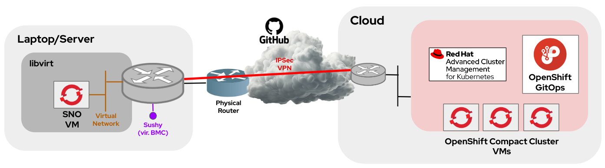
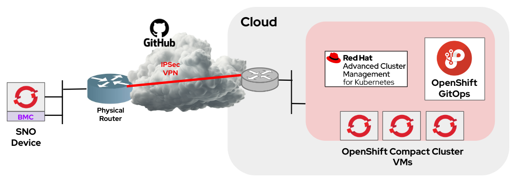
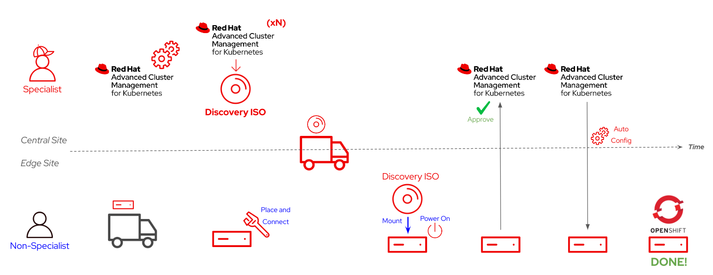
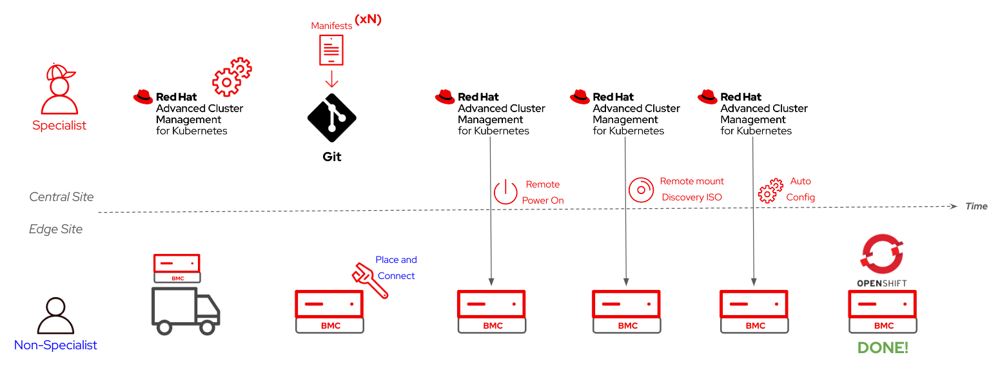
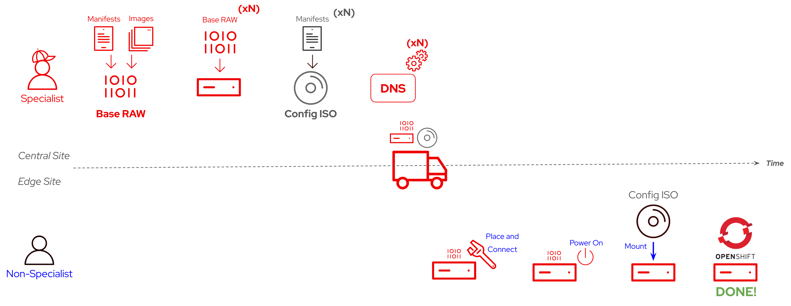
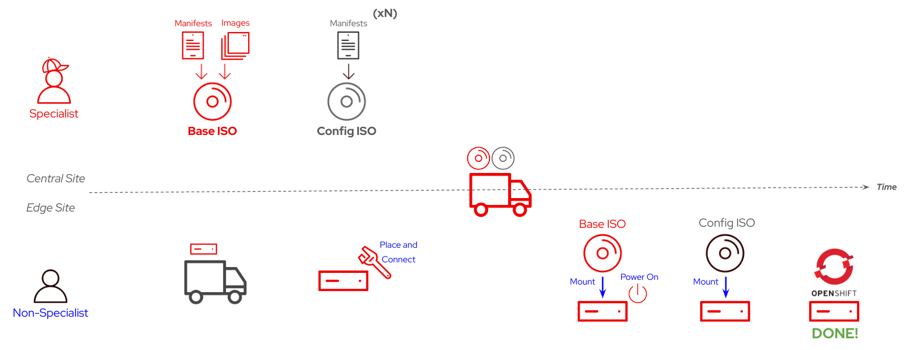

# OpenShift Zero-Touch Provisioning

## Overview

This Zero-Touch Provisioning demo highlights the power of Red Hat OpenShift in edge computing scenarios. If you're interested in exploring what's possible with Red Hat Device Edge and Ansible Automation Platform, be sure to check out the [Red Hat Device Edge and Ansible Automation Platform demos](https://github.com/luisarizmendi/rhde-aap-gitops-demo).

### The Challenge

Edge computing use cases often involve a large number of devices and locations, combined with a lack of on-site specialized personnel. This makes it impractical to use the same deployment approaches that are common in data centers or cloud environments. At the edge, we cannot rely on individuals to follow complex installation procedures, nor is it cost-effective or timely to send experts to each location.

### The Solution

To address these challenges, we can prepare all deployment assets in advance to automate the process as much as possible, enabling a "zero-touch provisioning" experience. While specialized personnel are still required, they can remain at a central location. The actual deployment at the edge can be carried out by anyone capable of booting a device from an ISO, eliminating the need for technical expertise on-site.

## Key Concepts Covered in the Demo

* Advanced Cluster Management (ACM)
* OpenShift GitOps
* OpenShift Appliance
* OpenShift Assisted Installer

## Architecture

The architecture for this demo comprises a central site, where Advanced Cluster Management (ACM) and OpenShift GitOps (ArgoCD) are deployed on top of Red Hat OpenShift, and the Edge locations (one is sufficient for this demo) where the devices will be installed with Single Node OpenShift (SNO). Additionally, a GitHub or any other Git repository will be used to host the GitOps manifests.

The most common way to deploy this demo is creating the OpenShift Hub cluster (including OpenShift Advanced Cluster Management and OpenShift GitOps operator) in a remote location (ie. Public Cloud) and run either a physical device or a Virtual Machine locally. As you will read during the demo preparation, a VPN connection will be needed so the local OpenShift cluster can reach out to the OpenShift Hub nodes while using BMC deployment. 

> **NOTE:**
> Only demo section 2 needs direct connectivity (VPN), you can deploy section 1 and section 3 without a VPN.

Find below two diagrams showing two different possible demo setups:

* Using a virtual machine for the local Single Node OpenShift:

* Using a physical device:

Using Physical devices has some implications, for more information about the architecture can be found in the [Preparation and Requirements Guide](doc/00-preparation.md).

## Preparation and Requirements

This demo will require the same preparation time than actual delivery. Additionally, there are key considerations that may impact both how and what you use to present the demo, so please review the preparation document carefully.

Refer to the [Preparation and Requirements Guide](doc/00-preparation.md) for detailed setup instructions.

## Demo Overview

**Time required for preparing the demo:** Less than 120 minutes

**Time required for delivering the demo:** Less than 120 minutes

### TL;DR

If you're already familiar with the demo details and just need a list of steps, you can skip to the [steps summary](doc/steps-summary.md).

### Demo Sections

This demo explores three different methods to deploy an OpenShift cluster (specifically, a Single Node OpenShift) using a zero-touch provisioning approach.

### [1 - Assisted Installer with Advanced Cluster Management](doc/01-gui.md)

In this section, we pre-configure the cluster in Red Hat Advanced Cluster Management (ACM) and create a Discovery ISO, which is used at the edge location to boot and auto-configure the device. These steps can be performed centrally by a specialized person, while the actual deployment can be done by anyone who knows how to boot the device from an ISO (e.g., via USB).

**Deployment Workflow:**

0. Configure DNS
1. Configure the inventory and OpenShift cluster in ACM.
2. Create and download the "Discovery ISO" from ACM.
3. Boot the device from the "Discovery ISO."
4. Approve the device in ACM.
5. Launch the OpenShift cluster deployment from ACM.

Once OpenShift is installed, application delivery and cluster policy enforcement are automatically handled.

For multiple OpenShift clusters, repeat the above steps for each cluster.

**Detailed Workflow Diagram:**

### [2 - GitOps Provisioning with Advanced Cluster Management](doc/02-gitops.md)

The previous workflow offers a zero-touch provisioning experience, but it can be further automated using a GitOps approach. Instead of performing steps in the ACM GUI, we'll create the necessary objects for cluster deployment and store them in a Git repository. 

Additionally, we can eliminate the need for on-site personnel to boot the device from the "Discovery ISO" by utilizing a [Baseboard Management Controller (BMC)](https://en.wikipedia.org/wiki/Intelligent_Platform_Management_Interface#Baseboard_management_controller) from the central site. This approach saves time and simplifies the process for edge personnel, although it requires appropriate connectivity and may increase device costs.

**High-Level Workflow:**

0. Configure DNS
1. Configure ACM and create the OpenShift deployment objects.
2. Store these objects in a Git repository.
3. ACM powers on the device using the BMC.
4. The device downloads the discovery ISO directly from ACM.
5. The OpenShift cluster is auto-provisioned.

For multiple OpenShift clusters, create separate manifests for each cluster and push them to the Git repository.

**Detailed Workflow Diagram:**

### [3 - OpenShift Appliance](doc/03-appliance.md)

The previous approach offers the most automation but requires a device with BMC and the associated connectivity. If such connectivity cannot be provided, or if it is slow or unstable, a different zero-touch provisioning method is required, in this case you can use the "OpenShift Appliance".

With the OpenShift Appliance approach, you create a device with all necessary manifests and images embedded, allowing for self-provisioning on first boot and automatic configuration when a USB with the required OpenShift customizations is inserted.

This method involves two key assets:

1. **Base Image:** This image contains all the container images and manifests common to all OpenShift clusters you plan to deploy. It can be either a RAW image that you burn directly onto the device or an ISO for first-time deployment.
2. **Configuration ISO:** This is unique to each cluster, containing specific cluster details (e.g., cluster name, base domain) and manifests.

**Simplified Workflow:**

0. Configure DNS
1. Create the Base Image (can be done on your laptop; ACM is not required).
2. Create the Configuration ISO.
3. Burn the Base RAW Image onto the device or boot from the Base Image ISO.
4. Connect the Configuration ISO (this triggers automatic customization).

For multiple OpenShift clusters, create a different Configuration ISO for each one.

**RAW Image Workflow Diagram:**

**ISO Workflow Diagram:**

### Demo Recording

(TBD).

## Conclusion

In this demo, we've explored how to deploy OpenShift in edge computing scenarios where on-site specialized personnel are not available. OpenShift's flexibility shines in these challenging environments, offering multiple zero-touch provisioning methods tailored to various needs:

1. **Assisted Installer with ACM:** This method allows for the easy pre-configuration of clusters, enabling non-technical personnel at edge locations to deploy OpenShift simply by booting from an ISO. This approach minimizes human error and accelerates deployment timelines.

2. **GitOps with ACM and BMC:** By automating the deployment process further with GitOps and leveraging BMC for remote device management, you can reduce on-site interaction to nearly zero. This not only streamlines operations but also ensures consistency and scalability across numerous edge locations.

3. **OpenShift Appliance:** For disconnected or semi-disconnected environments, the OpenShift Appliance method provides a robust solution. It embeds all necessary components directly into the device, making deployment as easy as plugging in a USB stick. This approach is ideal for remote locations with limited connectivity, ensuring that OpenShift can be deployed anywhere, regardless of network conditions.

The benefits of using OpenShift for edge use cases are clear. It simplifies the complexities of deploying and managing Kubernetes clusters across dispersed and challenging environments, reduces the need for on-site technical expertise, and accelerates time-to-value. OpenShift’s robust and versatile tools make it an exceptional choice for organizations looking to extend their cloud-native capabilities to the edge, ensuring reliable, scalable, and secure operations no matter where your infrastructure resides.

