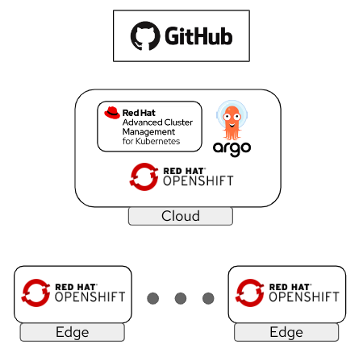

# OpenShift Zero Touch Provisioning

## Background

### The Challenge

The Edge Computing use cases use to have characteristics such as high number of devices and locations or lack of on-site specialized personell that makes not possible to use the same kind of environment deployment approaches that we use at the Data Center or Cloud, since we cannot expect neither the people that are at the edge location follow any complicated installation procedure nor sending someone with the right knowledge to all the edge locations, since that will imply a high cost and deployment delays. 

### The Solution

Instead of performing a solution deployment that comprehends multiple steps in the edge location, we can prepare all the assets in advance to automate as much as we can the deployment procedure, enabling a "zero-touch provisioning" experience.

We still need specialized people, but those don't need to move to the edge locations, and since the deployment does not need any interaction, any non-specialized person will be able to perform the installation.

## Concepts Reviewed During the Demo

* Advanced Cluster Management 
* OpenShift GitOps
* OpenShift Appliance
* OpenShift Assisted Installer

## Architecture

### Recommended Hardware

### Required connectivity

## Preparation and Requirements

* [Preparation and requirements ](doc/00-preparation.md).

## Demo

**Time required for preparing the demo**: <120 minutes

**Time required for delivering the demo**: <90 minutes 

### TL/DR

If you already know the demo details and just want a list of demo steps, you can jump into the [steps summary](doc/steps-summary.md).

### Demo Sections

In this demo, we will explore three different ways to deploy an OpenShift cluster (Single Node OpenShift in this case) using a zero-touch provisioning approach.

### [1 - Assisted installer with Advanced Cluster Management](doc/01-gui.md)

In this first section we are going to pre-configure the cluster in Red Hat Advanced Cluster Management, creating a Discovery ISO that will be used at the edge location to boot and auto-configure the device.

This is the (simplified) deployment workflow that will be used in this section:

1. Configure the Inventory and OpenShift cluster in ACM

2. Create and download the "Discovery ISO" from ACM

3. Boot the device from the "Discovery ISO"

4. Approve the device in ACM

5. Launch OpenShift cluster deployment from ACM

Once the OpenShift is installed, Application delivery and Cluster Policy enforcement are automatically done in that cluster.

For a more comprehensive workflow, including roles and locations, take a look to the following diagram:

### [2 - GitOps provisioning with Advanced Cluster Management](doc/02-gitops.md)

During the second section we will use the GitOps approach for the OpenShift cluster deployment. Instead of performing the steps on the ACM GUI, we will prepare ACM and create the associated objects required for the cluster  

BMC

###  [3 - OpenShift Appliance](doc/03-appliance.md)

### Demo recording

TBD

## Closing

recordar que tarda tiempo los demo-ztp-cluster y demo-ztp policies porque se está aplicando el path

crear namespace "demo-ztp" con los secrets

cat ~/pull-secret | base64 -w0

check that new argocd repo pod is generated and not in pedning because no resources

sobre las VMs:
libvirt con current and maximum memory para tener mas memoria en la VM

DNS config -> se puede hacer en AWS

GUI
---------------

si tiene 16GB de memoria justo, puede que exista un tiempo despues de incluir el server que ponga 15 con algo... hay que esperar
    Success alert:1 host selected out of 1 identified.
    Total compute: 12 CPUs | 15.46 GiB Memory

steps:

1) create dns records

2) Add hosts to inventory > Create infrastructure environment

* Add env. name, localtion, pull secret

* (optional set static IP)

* Click Create

(NOTE: puedes encontrar un error trtansitorio en la web de que ciertos componentes no existen o no están corriendo correctamente. espera un minuto a ver si se van) algo como esto:

Danger alert:Failing infrastructure environment

    Failed to create image due to an internal error
    failed to find secret pullsecret-demo-sno-gui
    failed to get secret demo-sno-gui/pullsecret-demo-sno-gui from API
    secrets "pullsecret-demo-sno-gui" not found

* Create nmstate yaml with +

apiVersion: agent-install.openshift.io/v1beta1
kind: NMStateConfig
metadata:
  name: <node name>
  namespace: <environment name>
  labels:
    infraenvs.agent-install.openshift.io: <environment name>
spec:
  config:
    interfaces:
      - name: eth0
        type: ethernet
        state: up
        mac-address: <device mac>
        ipv4:
          enabled: true
          address:
            - ip: <ip address>
              prefix-length: <net mask>
          dhcp: false
    dns-resolver:
      config:
        server:
          - <dns server>
    routes:
      config:
        - destination: 0.0.0.0/0
          next-hop-address: <gateway ip>
          next-hop-interface: eth0
          table-id: 254
  interfaces:
    - name: "eth0"
      macAddress: "<device mac>"

example:

apiVersion: agent-install.openshift.io/v1beta1
kind: NMStateConfig
metadata:
  name: sno-gui
  namespace: demo-gui
  labels:
    infraenvs.agent-install.openshift.io: demo-gui
spec:
  config:
    interfaces:
      - name: eth0
        type: ethernet
        state: up
        mac-address: 84:8b:cd:4d:15:37
        ipv4:
          enabled: true
          address:
            - ip: 192.168.140.3
              prefix-length: 24
          dhcp: false
    dns-resolver:
      config:
        server:
          - 8.8.8.8
    routes:
      config:
        - destination: 0.0.0.0/0
          next-hop-address: 192.168.140.1
          next-hop-interface: eth0
          table-id: 254
  interfaces:
    - name: "eth0"
      macAddress: "84:8b:cd:4d:15:37"

* Download ISO

* Start device with ISO, wait and approve host

2) create new cluster->host inventory->standalone > Use exsitiing host

* include: clsuter name, cluster set, base domain, "install sno", pull-secret

* enable yaml view and para reducir el sno añadir:

kind: AgentClusterInstall
metadata:
  annotations:
    agent-install.openshift.io/install-config-overrides: |
      {"networking":{"networkType":"OVNKubernetes"},
        "capabilities": {
          "baselineCapabilitySet": "None",
          "additionalEnabledCapabilities": [
            "NodeTuning",
            "OperatorLifecycleManager",
            "marketplace",
            "Ingress"
          ]
        }
      }

cuando lo revisas no aparecen las annotations (la pagina con el fondo blanco) pero si están ahí

* Autoselect host or manually, next

* (optional add ssh key), next

* Click "Install cluster" and Wait

3) Check argocd, it should install the demo hello app

siteconfig
---------------

VPN

appliance
----------------

Configura DNS api.<name> and *.apps.<name>  and api-int

poner el vars_secret. pull secret cuidado con las comas simples, tiene que ser asi: pullSecret: '{"auths":{<redacted>}}'

revisar vars.yaml (ip, dns name...).

log into registry.redhat.io en usuario y root

necistas bastante espacio de disco (en mi prueba 170GB), también tener en cuenta que la iso es de 32 GB:
appliance_assets/build-image/output on  main [!] 
❯ ls -lh
total 61G
-rw-r--r--. 1 root root 32G Aug  5 09:57 appliance.iso
-rw-r--r--. 1 root root 29G Aug  5 09:47 appliance.raw

install openshift-install desde  https://mirror.openshift.com/pub/openshift-v4/x86_64/clients/ocp/ pero estate seguro de que es la misma versión de openshift-install que la de la imagen (ocp_release_version)

OPTIONAL IP STATIC (in appliance_assets/build-config-iso/config/agent-config-template.yaml)
//
hosts:
  - hostname: sno-appliance
    interfaces:
      - name: eth0
        macAddress: 84:8b:cd:4d:15:37
    networkConfig:
      interfaces:
        - name: eth0
          type: ethernet
          state: up
          mac-address: 84:8b:cd:4d:15:37
          ipv4:
            enabled: true
            address:
              - ip: 192.168.140.3
                prefix-length: 24
            dhcp: false
      dns-resolver:
        config:
          server:
            - 8.8.8.8
      routes:
        config:
          - destination: 0.0.0.0/0
            next-hop-address: 192.168.140.1
            next-hop-interface: eth0
            table-id: 254

//

*** NOTE IF YOU CONFIGURE STATIC IP YOU NEED TO HAVE nmstatectl INSTALLED IN YOUR LAPTOP to check the config while creating the image-config iso. If you use Fedora do it by installing sudo nmstate package

OPTIONAL COMPOSABLE (in appliance_assets/build-config-iso/config/install-config-template.yaml)
//
capabilities:
  baselineCapabilitySet: None
  additionalEnabledCapabilities:
  - NodeTuning
  - OperatorLifecycleManager
  - marketplace
  - Ingress

//

crea la imagen e iso antes de comenzar la demo con el script 00-build-appliance.sh

NOTE: Takes time and needs reliable network (descarga 30GB en imagenes), 

Si quieres puedes ver el log en `sudo podman logs -f 8fc71e1c987d` siendo el id del container, este es un ejemplo del log final de la generación del RAW image:
❯ sudo podman logs -f 8fc71e1c987d
WARNING OCP release version 4.16.4 is not supported. Latest supported version: 4.15. 
INFO Successfully downloaded appliance base disk image 
INFO Successfully extracted appliance base disk image 
INFO Successfully pulled container registry image 
INFO Successfully pulled OpenShift 4.16.4 release images required for bootstrap 
INFO Successfully pulled OpenShift 4.16.4 release images required for installation 
INFO Successfully generated data ISO              
INFO Successfully fetched openshift-install binary 
INFO Successfully downloaded CoreOS ISO           
INFO Successfully generated recovery CoreOS ISO   
INFO Successfully generated appliance disk image  
INFO Time elapsed: 33m13s                         
INFO                                              
INFO Appliance disk image was successfully created in assets directory: assets/appliance.raw 
INFO                                              
INFO Create configuration ISO using: openshift-install agent create config-image 
INFO Download openshift-install from: https://mirror.openshift.com/pub/openshift-v4/x86_64/clients/ocp/4.16.4/openshift-install-linux.tar.gz 

demo start:
- deploy the image with the base usb
- deploy config
- check ip, check /etc/assistecd/ 
- when finish: check apps, check operators

-> se puede ver el progreso con `watch "oc --kubeconfig image-config/auth/kubeconfig get pod --all-namespaces"` y también en los containers de root (podman logs y también crictl logs)

also oc --kubeconfig output/image-config/auth/kubeconfig get clusterversion and also "get co"