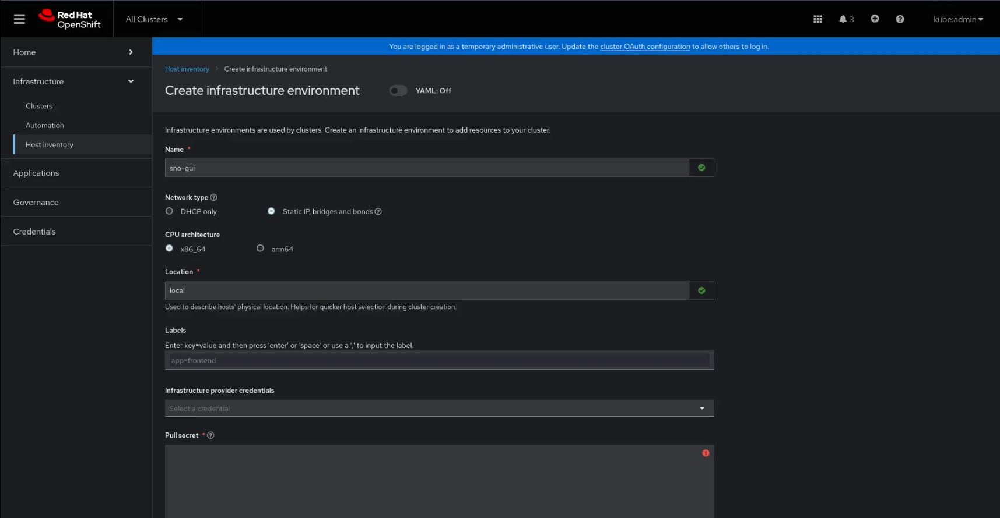
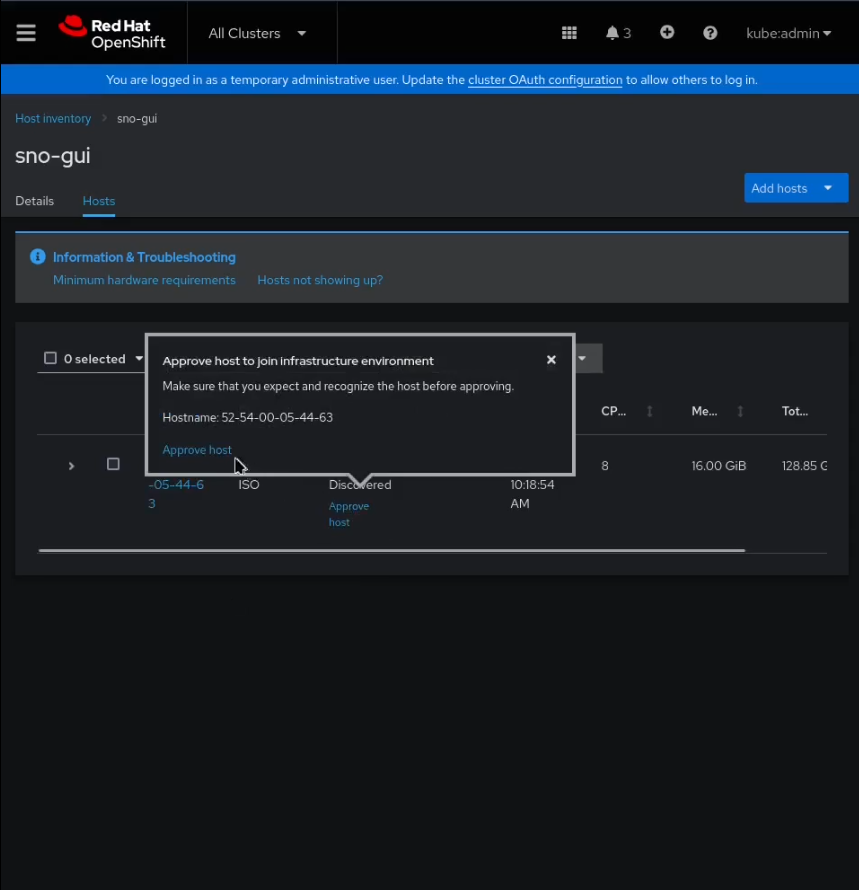
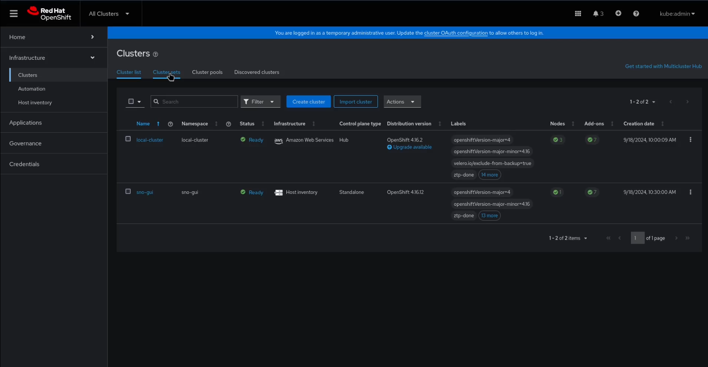

# Section 1 - Assisted Installer with Advanced Cluster Management

## Demo section video recording

[](https://youtu.be/ok4EYxCId5Y?si=z_2Q1WSaAv2D7efQ)


---

## Time required

45 minutes (30 minutues waiting for OpenShift deployment)

---

## Environment Review

The environment has been pre-configured to streamline the demo, focusing on showcasing zero-touch provisioning. Several key components have already been set up for you:

* **ClusterSet and ClusterSetBinding**: A group to host the cluster you'll create, keeping it isolated from others.
* **Placement**: To select clusters for deploying applications and ACM policies within the new ClusterSet.
* **Policy**: A pre-created policy deploys an example operator (`openshift-compliance` in this case).
* **GitOpsServer and ApplicationSet**: Automatically deploys the `hello-world` test application to the new cluster when it is imported into ACM.
* **AgentServiceConfig**: The Assisted Installer service has been enabled to facilitate cluster creation.

## Preparation

Ensure that [all prerequisites are met](00-preparation.md) before proceeding with the demo.

Also, **double-check DNS entries** to ensure correct cluster deployment.

---

## Demo Steps

### 1. Configure the Inventory and OpenShift Cluster in ACM

While the GUI allows you to create the cluster and host inventory at once, we will break down the steps for clarity.

1. In ACM, navigate to **"All Clusters"** in the dropdown (top-left corner).
2. Go to **Infrastructure > Host Inventory** and click **Create infrastructure environment**.

    > **NOTE:**  
    > If you encounter an "Info alert: Configuration is hanging for a long time" message, wait a minute for the cluster to complete the bootstrap process.




3. Provide a name (e.g., `sno-gui`), location, and your pull secret. If needed, mark the **"Static IP" Network type** and add your public SSH key to access OpenShift nodes via SSH. Click **Create**.

    > **NOTE:**  
    > If you see "Warning alert: Central Infrastructure Management is not running," wait for the cluster to finish the ArgoCD configuration (`bootstrap-demo.yaml`).

4. *(Optional)* If using **Static IP**, create the associated NMState object for Node network settings. Click the `+` OpenShift button, paste the contents of [sno-1-network.yaml](../demo-manifests/00-gui/sno-1-network.yaml), and adjust it as needed.

5. Click the **Host** tab, then click **Add host** (top-right corner) and select **With Discovery ISO**. Download the Discovery ISO.


6. Boot your edge device using the Discovery ISO.

    > **NOTE:**  
    > For physical hardware, create a bootable USB from the ISO using `dd` or any other tool.

7. After booting, the device will appear in the **Hostname** list. Click **Approve host** to make it available. Optionally, change the hostname from the MAC address to something like `sno-1.sno-gui.<domain>`.




    > **NOTE:**  
    > It may take around 2.5 minutes for the host to appear in the list.

### 2. Launch the OpenShift Cluster Deployment from ACM

Once your device is in the inventory, use it to deploy the OpenShift cluster:

1. In ACM, go to **Infrastructure > Clusters** and click **Create cluster**.
2. Select **Host inventory**, **Standalone**, and **Use existing hosts**.
3. Add the cluster details:
    * Cluster Name: e.g., `sno-gui`
    * ClusterSet: `demo-ztp-gui`
    * Base domain, check **Install single node OpenShift**, and include your pull secret.

4. *(Optional)*  You can reduce hardware usage by removing unnecessary operators ([Composable OpenShift feature](https://access.redhat.com/solutions/7025867)):
    * Click **YAML view**.
    * Add the following [annotation](../demo-manifests/00-gui/install-config-overrides.yaml) to the `AgentClusterInstall` resource to remove the Web Console and other components:

      ```yaml
      kind: AgentClusterInstall
      metadata:
        annotations:
          agent-install.openshift.io/install-config-overrides: |
            {"networking":{"networkType":"OVNKubernetes"},
              "capabilities": {
                "baselineCapabilitySet": "None",
                "additionalEnabledCapabilities": [
                  "NodeTuning",
                  "OperatorLifecycleManager",
                  "marketplace",
                  "Ingress"
                ]
              }
            }
      ...
      ```

    > **NOTE:**  
    > By following this step using the provided example, you remove the Web Console, so you'll need to manage the cluster via ACM or `oc` CLI.


* Click **Next**, then **Next again** (no further automation setup needed), and finally **Save**.

* Keep **Auto-select hosts** checked and click **Next**. Add your public SSH key, then click **Next** again.

    > **NOTE:**  
    > If you configured the `install-config-overrides`, be aware that these settings will not appear on the right-hand YAML screen. However, you can verify the configuration by running:  
    > `oc get AgentClusterInstall -n sno-gui -o yaml`.  
    > This will confirm that the overrides were applied correctly.

* Wait until the "Cluster is not ready yet" message disappears, then click **Install Cluster**.


    > **NOTE:**  
    > The deployment takes, depending on the resources in your node, and the network connectivity, around 30 minutes.

Once the cluster is installed and shows a **"Ready"** status under **Infrastructure > Clusters**, with all **Add-ons** marked green, you can continue with the next step.




### 3. Check your OpenShift Deployment

Verify the following:

#### New Cluster is Part of the ClusterSet

The bootstrap process created a `demo-ztp-gui` ClusterSet to group OpenShift clusters. Confirm that your new cluster is part of this ClusterSet:

1. Navigate to **Infrastructure > Clusters** and select the **Cluster sets** tab.
2. Select the **demo-ztp-gui** ClusterSet and switch to the **Cluster list** tab to verify the cluster inclusion.

#### Cluster Policy Has Been Applied

As mentioned in the "Environment Review," a pre-configured policy ensures that the "OpenShift Compliance Operator" is available on the new cluster. The policy creates the required `subscription` and `operator group` objects.

To verify that the policy has been applied:

1. Go to **Governance** and click on the **Policies** tab.
2. Select the **demo-ztp-gui** Policy.
3. Click the **Results** tab to check the policy enforcement status.

> **NOTE:**  
> It could take several minutes to complete the policy enforcement and mark the Cluster as "Without violations"


The policy prepares the new cluster for the Compliance Operator. You can verify that the subscription is present on the cluster using either the `oc` CLI or, if you didn't remove the Web Console, by navigating the Web UI.


```bash
oc login -u kubeadmin https://api.sno-gui.<domain>:6443
oc get subs --all-namespaces
```

> **NOTE:**  
> Remember that you can retrieve the `kubeadmin` password by selecting the cluster in **Infrastructure > Clusters** and clicking on the credentials tab.

#### Test Application Was Deployed

The bootstrap process also applied the [`23-demo-gui-welcome-app.yaml`](../bootstrap-demo/resources/base/23-demo-gui-welcome-app.yaml) file, which creates an `ApplicationSet` associated with clusters in the `demo-ztp-gui` ClusterSet. This `ApplicationSet` deploys the "Hello-World" test application.

To verify this in ArgoCD:

1. Navigate to the **ArgoCD** portal:
    * Click the **six squares** icon (top-right corner) in the Hub OpenShift Web Console to access ArgoCD.

2. In ArgoCD:
    * Click **Settings** on the left menu, then select **Clusters**.
    * You should see the `sno-gui` cluster listed, automatically created thanks to the ACM and ArgoCD integration.

3. Next, click on **Applications** to see the `hello-sno-gui` application. This confirms that the demo test application was deployed successfully. If you want to double check it you can check the route in the cluster (ie. with `oc get route -n hello`) and visit the URL.

You can also use the "Applications" menu from ACM. Search `demo-ztp-gui-apps` application and check the Overview and Topology tabs.


---

## Review

In this demo, we demonstrated how to deploy an OpenShift Cluster at an edge site with minimal intervention. The only required manual step is to attach a Discovery ISO and boot from it.

Key points from the demo:
- **Cluster Automation**: Through central configuration, the cluster is automatically bootstrapped with relevant policies once created.
- **Policy Enforcement**: Pre-configured policies (like the one enforcing the OpenShift Compliance Operator) are applied automatically.
- **Automated Application Deployment**: By using ArgoCD, pre-defined applications like the "Hello-World" test app can be deployed to newly created clusters.

An example hello-word application and a simple policy that installs the Complaince Operator in the new cluster were used but the same principle can be applied to much more complicated policies and any Application that you could need to be running in the cluster automatically right after the deployment.

This automation simplifies the process for edge personnel, ensuring that OpenShift clusters can be set up with minimal manual intervention, as the deployment and post-configuration tasks are fully automated.