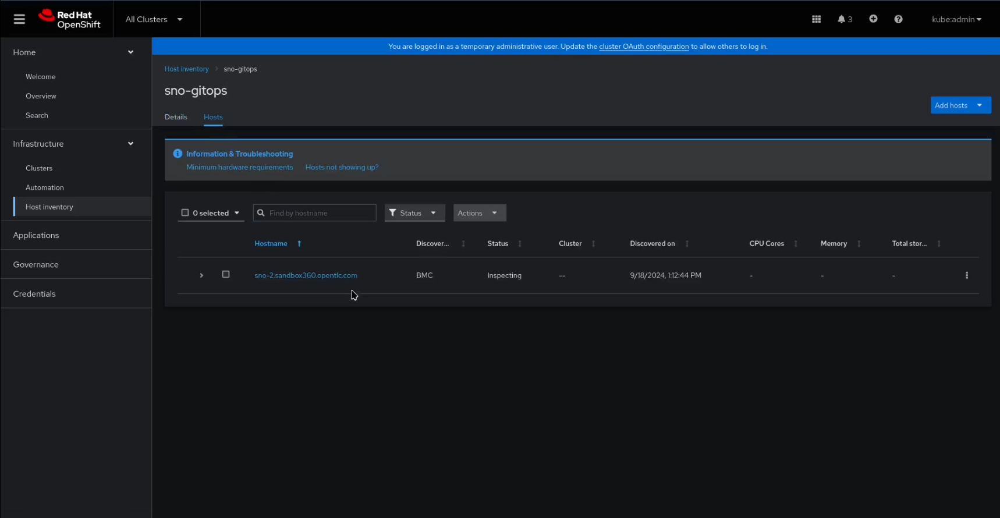
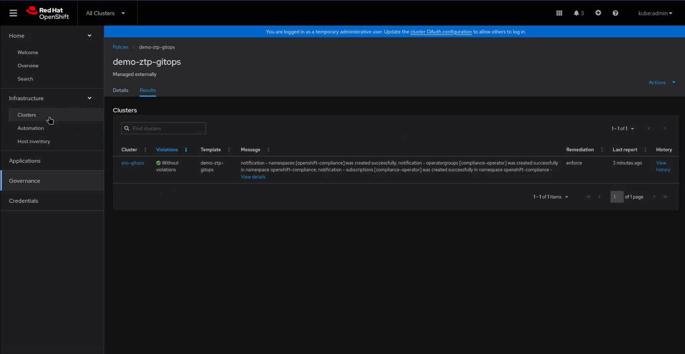

# Section 2 - GitOps with ACM and BMC

## Demo section video recording

[](https://youtu.be/oWKJ8JqJUhw?si=17v-m6Ot3Cd_0c78)


---

## Time required

60 minutes (40 minutues waiting for OpenShift deployment)


---
## Environment review


The environment has been prepared to perform Zero-Touch Provisioning (ZTP) using the Assisted Installer and Redfish BMC. Unlike the previous section, no additional configurations (such as `Policies`, `ClusterSet`, `Placement`) have been pre-applied. In this section, everything will be created through a single ArgoCD Application object.

---

## Preparation

Ensure that [all pre-requisites are met](00-preparation.md) before starting the demo steps.

This demo assumes that ACM has direct access to the edge device (e.g., downloading the ISO via an OpenShift node's private IP). If ACM is deployed on an external network, ensure a VPN connection is established.

Additionally, if you are using virtual machines instead of physical devices with real BMCs, confirm that the [virtual BMC](../../../tools/virtual-bmc/README.md) is running. Also, check that your DNS entries are properly configured before proceeding.

---

## Demo Steps

### 1. Create the Pull-Secret and BMC Secrets

First, create the BMC secret:

1. Access your OpenShift console in the Hub cluster.
2. Click the `+` button to add resources.
3. Paste the content from the [00-gitops-bmc-secret.yaml](../demo-manifests/01-gitops/00-gitops-bmc-secret.yaml) file.


Next, create a secret for your pull-secret token in the OpenShift cluster namespace:

1. Access your OpenShift console in the Hub cluster.
2. Click the `+` button to add resources.
3. Paste the content from the [01-gitops-pull-secret.yaml](../demo-manifests/01-gitops/01-gitops-pull-secret.yaml) file.

> **NOTE:**  
> This pull-secret file was created during the demo preparation phase.


### 2. Create the Bootstrap ArgoCD Application Object

ArgoCD will handle the creation of all required remaining objects. To create the ArgoCD Application, follow these steps:

1. Access your OpenShift console in the Hub cluster.
2. Click the `+` button to add resources.
3. Paste the content from the [02-argocd-app.yaml](../demo-manifests/01-gitops/02-argocd-app.yaml) file.

Once the object is created, you can demonstrate the following:

- **ArgoCD**: Show the ArgoCD applications syncing and turning green.
  
  In the ArgoCD portal, you will see three new Applications:
  - **Global Application**: Triggers the deployment of the other two.
  - **Cluster Application**: Creates the OpenShift cluster objects.
  - **Policy Application**: Creates the ACM-related policies and placement objects.

- **ACM**: Go to **Infrastructure > Host Inventory**.
  
  A new Host inventory named `sno-gitops` should appear. 




> **NOTE:**  
> If you encounter a "Metal3 operator is not configured" warning in the Host Inventory, wait for a minute for auto-configuration. If the message persists, try deleting the `Provisioning` object under `provisioning-configuration` (it will be recreated by ArgoCD).


### 3. Wait Until the Device Is Onboarded

In **Infrastructure > Host Inventory**, the baremetal host in the `sno-gitops` environment will transition through the following states: **Registering > Inspecting > Provisioning**. This process typically takes around 7.5 minutes.

> **NOTE:**  
> If the process fails, remove the node from the Host Inventory (it will be regenerated, but you will need to recreate the BMC secret). Check that the OpenShift Hub nodes can connect to the edge device's BMC. If issues persist and you want to start over, remove the ArgoCD Applications, ensure the Baremetal, Secret, and InfraEnv objects are deleted, and recreate the `00-argocd-app.yaml`. You may also need to recreate the BMC secret.

After the node is ready (you may briefly see an "Insufficient" status), the OpenShift cluster installation will begin. You can monitor the installation under **Infrastructure > Clusters** by selecting the `sno-gitops` cluster. Depending on your setup (VM and network connectivity), the installation may take around 30 minutes.

Once the cluster is installed and shows a **"Ready"** status under **Infrastructure > Clusters**, the cluster will begin the import process. Wait until all **Add-ons** are green, then proceed to the next step.


### 4. Check Your OpenShift Deployment

Once the cluster is installed and shows a **"Ready"** status under **Infrastructure > Clusters**, with all **Add-ons** marked green, verify the following:

#### New Cluster Is Part of the ClusterSet

The bootstrap process created a `demo-ztp-gitops` ClusterSet to group OpenShift clusters. Confirm that your new cluster is part of this ClusterSet:

1. Go to **Infrastructure > Clusters** and select the **Cluster sets** tab.
2. Select the **demo-ztp-gitops** ClusterSet and switch to the **Cluster list** tab to verify the cluster inclusion.

#### Cluster Policy Has Been Applied

A pre-configured policy ensures that the "OpenShift Compliance Operator" is available on the new cluster. This policy creates the required `subscription` and `operator group` objects.

To verify the policy:

1. Go to **Governance** and click on the **Policies** tab.
2. Select the **demo-ztp-gitops** Policy.
3. Click the **Results** tab to check the policy enforcement status.

> **NOTE:**  
> Policy enforcement may take a few minutes, so wait until the cluster is marked as "Without violations".




This policy prepares the new cluster for the Compliance Operator. You can verify that the subscription is present using either the `oc` CLI or, if the Web Console was not removed, via the Web UI.


```bash
oc login -u kubeadmin https://api.sno-gitops.<domain>:6443
oc get subs --all-namespaces
```

> **NOTE:**  
> You can retrieve the `kubeadmin` password by selecting the cluster in **Infrastructure > Clusters** and clicking on the credentials tab.


#### Test Application Was Deployed

The bootstrap process also applied the [`23-demo-gitops-welcome-app.yaml`](../bootstrap-demo/resources/base/23-demo-gitops-welcome-app.yaml) file. This file creates an `ApplicationSet` associated with clusters in the `demo-ztp-gitops` ClusterSet, which deploys the "Hello-World" test application.

To verify this in ArgoCD:

1. Navigate to the **ArgoCD** portal:
    - Click the **six squares** icon (top-right corner) in the Hub OpenShift Web Console to access ArgoCD.

2. In ArgoCD:
    - Click **Settings** in the left-hand menu, then select **Clusters**.
    - You should see the `sno-gitops` cluster listed. This was automatically created thanks to the ACM and ArgoCD integration.

3. Next, click on **Applications** to see the `hello-sno-gitops` application. This confirms that the demo test application was deployed successfully. If you'd like to double-check, use the `oc` command:
    - Run `oc get route -n hello` to get the route in the cluster, and visit the resulting URL to confirm that the "Hello-World" app is running.

Alternatively, you can check the deployment using the "Applications" menu in ACM:
- Search for the `demo-ztp-gitops-apps` application.
- Explore the **Overview** and **Topology** tabs for a graphical view of the deployment.


---

## Review

In this section, we demonstrated how Zero-Touch Provisioning can be further simplified by eliminating the need to manually attach a Discovery ISO and configure the edge device to boot from USB. Using devices equipped with BMC (Baseboard Management Controller) and the automation provided by ACM, all provisioning can be managed centrally.

Instead of creating multiple objects via the GUI (such as `InfraEnv`, `AgentClusterInstall`, and `NMStateConfig`), we adopted a GitOps approach to configure everything as objects stored in a Git repository. Using a `SiteConfig` file, we were able to automatically generate the required objects for deploying the OpenShift cluster.

In this case, rather than pre-configuring Cluster Policies, we used a **Policy Generator Object** to automatically generate policies as part of the cluster deployment. The examples provided, such as the compliance-operator installation and the "Hello-World" application, are simple, but they demonstrate how this zero-touch provisioning approach removes all actions from edge personnel.

This approach simplifies the OpenShift deployment process significantly, but it does require devices with a BMC module and direct connectivity between the OpenShift Hub cluster and the BMC IP address.


