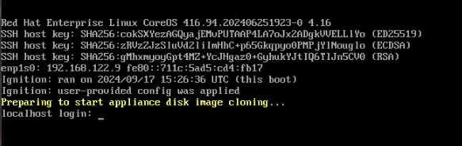
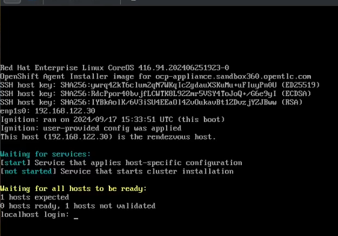
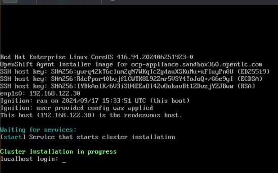

# Section 3 - OpenShift Appliance

## Demo section video recording

[](https://youtu.be/YEo0FWXEQQQ?si=xQ9-npyBQkGXO99B)


---


## Time required

60 minutes (50 minutes waiting for the deployment)

---

## Environment Review


For this section, you do not need the Central Site to perform the OpenShift Zero-Touch Provisioning. The OpenShift Appliance Image will be generated using a single Linux system, such as a laptop.

---

## Preparation

Make sure to double-check that [all pre-requirements are met](00-preparation.md) before proceeding with the demo steps.

> **NOTE**  
> The Base and Config images were created during the preparation phase to save time. Refer to the [preparation documentation](00-preparation.md) and the OpenShift [Appliance Ansible playbooks](../../../tools/ocp-appliance/README.md) for details.

While preparing the OpenShift Appliance Images ("Base Image" and "Config Image"), you can set up static IPs in `agent-config.yaml` and select the desired `capabilities` in `install-config.yaml` to enable specific cluster features (e.g., demonstrating how to conserve resources).

---

## Demo Steps

### 1. Deploy the Base Image

To deploy the Base Image, you can either:

- Copy the RAW image directly to the disk (e.g., using the `dd` command), or
- Use the Base Image ISO.

The ISO can be booted in a virtual machine (VM) or flashed to a USB drive for deployment on physical hardware. If you're using the ISO, ensure the system boots from it.

> **IMPORTANT**  
> There's an [issue](https://issues.redhat.com/browse/MGMT-18693) with USB partition tables created with OpenShift Appliance ISOs. This may prevent your system from booting directly. If you encounter this problem, consider using the RAW image (for both physical and virtual deployments) or deploying the OpenShift Appliance in a VM (since mounting via Virtual Media is unaffected).

The ISO offers an advantage over the RAW image, as it automatically resizes disk partitions. If using the RAW image, you will need to manually resize partitions to utilize the full disk space.

After booting the RAW image for the first time or booting from the ISO, you will see the "Preparing to start appliance disk image cloning" message in the console:, 



After some time, it will automatically create the partition table and start copying the data into the partitions. 


Finally the device will be rebooted and you find a message displayed in red waiting you to introduce the USB/ISO with the configuration image:


All the process could take around **10 minutes** (depending on your hardware).


### 2. Mount the Config Image

Next, mount the Config Image. As with the Base Image, the Config Image can be used directly in a VM or flashed onto a USB for use with physical hardware.

The device will automatically detect and mount the Config Image once you connect the USB or ISO. You should see a new "Preparing to start installation" message in the console, in yellow, followed by another one "Waiting for all host to be ready"




Some time after that, you will find a new green message indicating the "cluster installation is in progress".



It's time to wait until the cluster is installed. After a few minutes, the system will reboot a couple of times, and the OpenShift components will start being deployed.

To check the OpenShift deployment progress, use the `kubeconfig` file generated during Config Image creation (located in the `image-config/output/auth` directory if you used the [Appliance Ansible playbooks](../../../tools/ocp-appliance/README.md)). You can run the following command to monitor operator deployment progress:


```bash
watch "oc --kubeconfig output/image-config/auth/kubeconfig get co"
``` 

> **NOTE**  
> To use `oc` CLI with the OpenShift Appliance deployed, you need to replace `output/image-config/auth/kubeconfig` with the actual path to your `kubeconfig` file that you can find in the `output/config` folder created by the [ocp-appliance scripts](../../../tools/ocp-appliance/):


The deployment is complete when all operators have been successfully deployed (expect **45 minutes**, although it depends on your hardware). 


### 3. Test Your OpenShift Appliance

Once the system reboots, OpenShift will take some time to start all necessary services. After everything is up and running, verify that the customizations you applied during the Base and Config Image creation are in effect.


For example, if you followed the [Appliance Ansible playbooks](../../../tools/ocp-appliance/README.md), you can check that the following were created:

- Subscription to the `openshift-compliance` operator (Base Image customization).

```bash
oc --kubeconfig output/image-config/auth/kubeconfig get subs --all-namespaces
```


- The `hello-world` application is running (Config Image customization).

```bash
oc --kubeconfig output/image-config/auth/kubeconfig get pod -n hello-world
```

---

## Review

The OpenShift Appliance deployment method offers a robust alternative to Zero-Touch Provisioning. It is similar to the ACM GUI-based method but requires interaction with USB or ISO images for booting.

The benefit of OpenShift Appliance is that it can be used in complete disconnected environments, where the edge location cannot even connect to the central site where ACM is located.

This approach allows you to embed custom manifests within the images, automating the deployment of configuration and applications at installation time. It ensures that edge personnel can deploy OpenShift clusters with minimal intervention and without needing continuous connectivity to a central management system.

