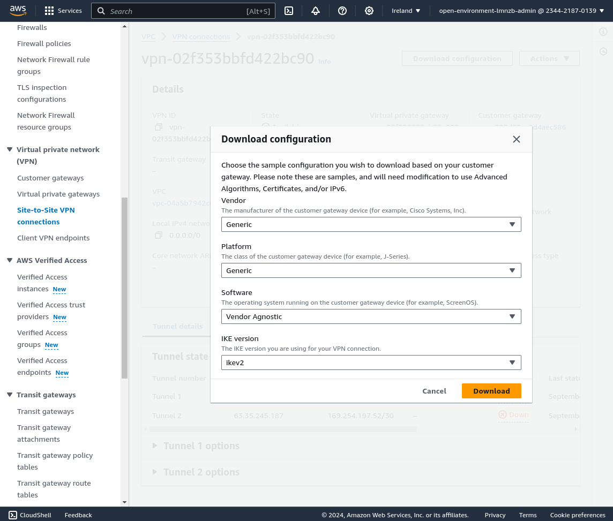

# Create an IPSEC VPN in AWS

This playbook enables you to create and configure the necessary AWS components to establish a VPN for demonstration purposes.

> **Note**  
> This setup is intended for demonstration purposes only. It functions correctly but is not recommended for production environments.

## Prerequisites

### 1. VPC in AWS

- **If you deployed OpenShift in AWS:** A VPC will already be created, so no additional setup is required.
- **If you didn't deploy (yet?) OpenShift:** You will need to create a VPC for the VPN.

## Creating the VPN

### 2. Create the VPN in AWS using the Ansible Playbook

1. Modify the values in `ansible/vars.yaml` to fit your environment, specifically:
   - `customer_gateway_ip`
   - `aws_region`
   - `local_ipv4_cidr`

2. Run the `create_aws_vpn.sh` shell script to create the VPN.

### 3. Download the AWS VPN Configuration File

Once the script completes, the VPN will be created. Navigate to **VPC > Virtual private network (VPN) > Site-to-Site VPN** in the AWS console. Select the VPN ID and download the configuration file for your VPN (top right corner). Depending on your local VPN endpoint, choose the appropriate configuration file.

If using Linux, OpenWRT, or another non-listed system, download the "Generic" (IKEv2) configuration file.




### 4. Configure Your Local VPN Endpoint

To assist with configuring your local VPN endpoint, additional Ansible playbooks are provided:

#### a. Libreswan on Linux

1. Run the following command to generate the necessary configuration files for `libreswan`:

   ```bash
   ansible-playbook -i ansible/inventory -e vpn_config_file=<path to the AWS generic config file> -vv ansible/translate_generic_ikev2_to_libreswan.yaml
   ```

2. This will generate `libreswan_ipsec.conf` and `libreswan_ipsec.secrets`. Copy these files to `/etc/ipsec.conf` and `/etc/ipsec.secrets` on your system (or to `/etc/ipsec.d` if you prefer to keep them in separate files).

3. Restart the IPsec service with:

   ```bash
   sudo systemctl restart ipsec
   ```

4. The VPN should now be established. Find one AWS Instance private IP (any OpenShift node) and ping to be sure that you have connectivity.


#### b. Strongswan on OpenWRT

1. Install the required packages on the OpenWRT router:

   ```bash
   opkg update
   opkg install strongswan-minimal strongswan-mod-aes strongswan-mod-hmac strongswan-mod-sha1 kmod-ip-vti vti luci-proto-vti strongswan-mod-kdf
   ```

2. Identify the name of your outbound external interface on the OpenWRT router. It is usually wan for a cabled network, or the SSID of your wireless network if using Wi-Fi as the default route.

3. Run the following playbook on your laptop:

   ```bash
   ansible-playbook -i ansible/inventory -e interface_name=<wan interface name> -e vpn_config_file=<path to the AWS generic config file> -vv ansible/translate_generic_ikev2_to_openwrt.yaml
   ```

4. This will generate the `openwrt_ipsec.conf` and `openwrt_ipsec.secrets` files. Copy these to `/etc/ipsec.conf` and `/etc/ipsec.secrets` on your router.

5. The playbook also generates content for `openwrt_network` and `openwrt_firewall`. **Append** this content to the end of the` /etc/config/network` and `/etc/config/firewall` files on your router.

6. Restart the necessary services on the router:

   ```bash
   /etc/init.d/ipsec enable
   /etc/init.d/ipsec restart
   /etc/init.d/firewall restart
   /etc/init.d/network restart
   ```

7. The VPN should be up within a few seconds. Verify the status by checking the system logs with logread or reviewing the tunnel status with ipsec statusall, and find one AWS Instance private IP (any OpenShift node) and ping to be sure that you have connectivity.

## Deleting the VPN

To delete the VPN, run the destroy_aws_vpn.sh shell script.

> **Important**  
> If you have an active OpenShift cluster and need to delete it while a VPN is active, the deletion process may stall. This occurs because the VPC associated with OpenShift is attached to the VPN. To avoid this issue, either detach the VPC from the VPN or delete the VPN before removing your OpenShift cluster.

